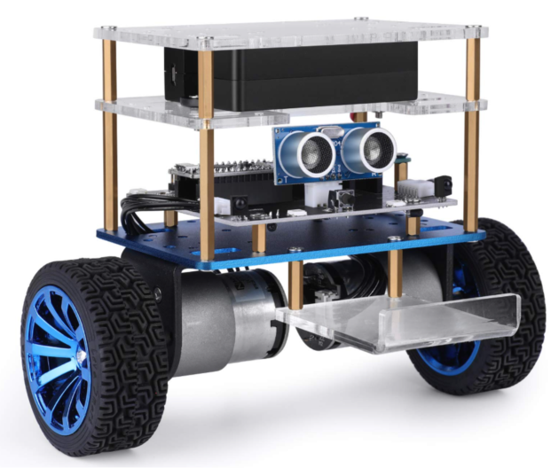
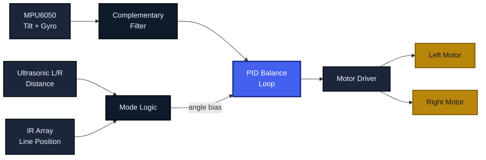
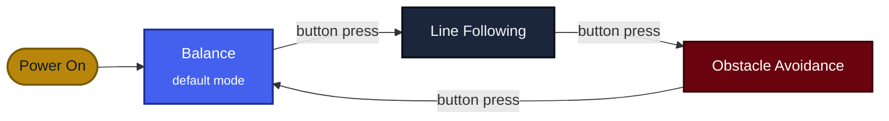
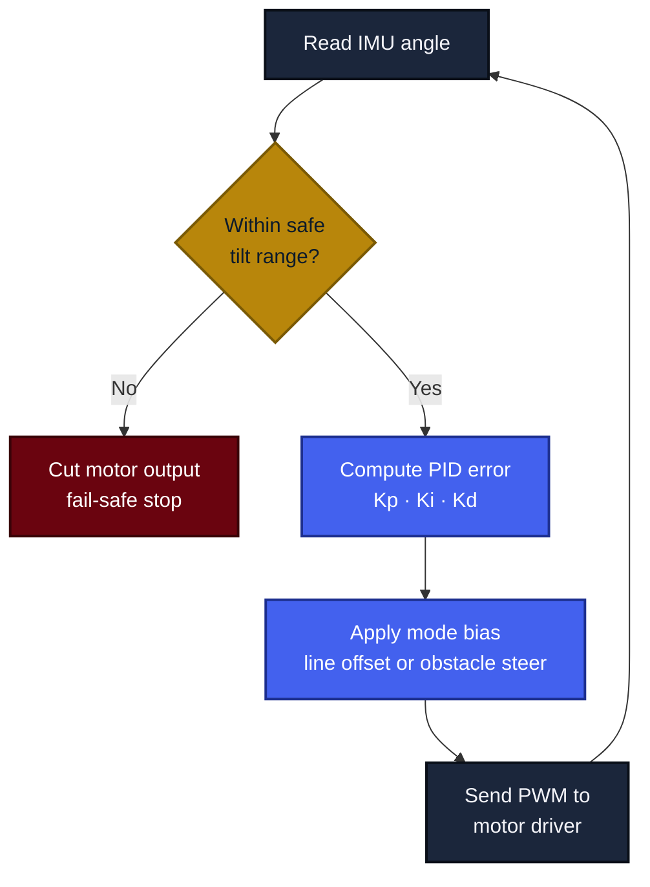
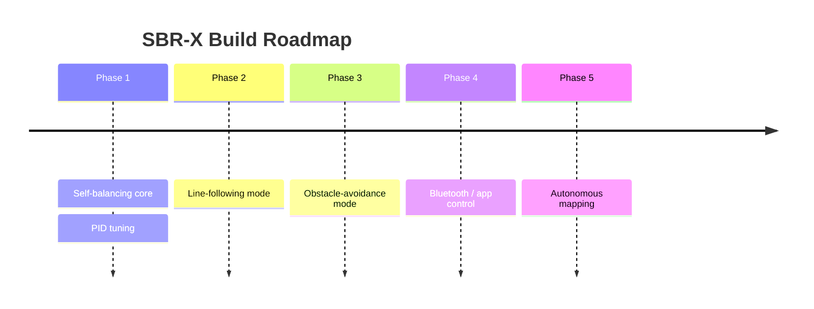

  

<h3 align="center">A Two-Wheeled Self-Balancing Robot with Autonomous Line Following and Obstacle Avoidance</h3>

  
  
  
  

  
  
  
  

 

## Overview

SBR-X is a two-wheeled robot that balances itself upright in real time while offering two selectable autonomous driving modes: **line following** and **obstacle avoidance**. An IMU feeds tilt data into a PID control loop running on the main controller, which drives a pair of DC motors through a motor driver to keep the chassis balanced at all times, whether idle, tracking a line, or steering around obstacles.

All balancing, sensing, and motion logic runs on a single microcontroller. No external computer, no cloud, no build step needed, flash it once and it runs standalone.

 

<table width="100%">
<tr>
<td width="25%" valign="top" align="center">

**Self-Balancing**
 
Closed-loop PID keeps the chassis upright on two wheels, correcting tilt continuously

</td>
<td width="25%" valign="top" align="center">

**Line Following**
 
Reads a reflectance array to track a line while staying balanced

</td>
<td width="25%" valign="top" align="center">

**Obstacle Avoidance**
 
Dual ultrasonic sensors detect and steer around obstacles ahead

</td>
<td width="25%" valign="top" align="center">

**One-Button Modes**
 
Cycles between all three modes without reflashing firmware

</td>
</tr>
</table>

 

## Hardware

  

SBR-X chassis: battery deck (top) · driver, IMU &amp; ultrasonic stage (middle) · dual-wheel drive base (bottom)

 

## System Architecture

Every actuation command traces back through the same balance loop, so line following and obstacle avoidance never override stability, they only steer it.

 

## Mode State Machine

Every mode balances continuously in the background. The button only changes which outer behavior biases the lean angle, balance is always active underneath.

 

## Control Loop

 

## Modes

| Mode | Description | Primary Sensor |
|---|---|---|
| **Balance** | Holds an upright position on two wheels, correcting for tilt in real time | MPU6050 IMU |
| **Line Following** | Tracks a dark line on a light surface (or vice versa) while balanced | IR reflectance array |
| **Obstacle Avoidance** | Detects obstacles ahead and steers around them while balanced | Dual ultrasonic sensors |

 

## Components

| Part | Role | Qty |
|---|---|---|
| Arduino Uno / Nano | Main controller, runs the PID loop and mode logic | 1 |
| MPU6050 (accelerometer + gyroscope) | Measures tilt angle and angular velocity for balancing | 1 |
| Dual ultrasonic sensor module | Forward obstacle detection | 1 |
| IR line sensor array | Line detection for line-following mode | 1 |
| L298N / TB6612FNG motor driver | Drives both DC motors from controller PWM signals | 1 |
| DC gear motors with wheels | Drive wheels | 2 |
| Li-ion battery pack | Onboard power for logic and motors | 1 |
| Acrylic chassis (tiered mounting plates) | Structural frame for all stages | 1 |
| Mode select push button | Switches between balance / line-follow / avoid | 1 |

Component list and wiring assumed from the build shown above. Update this table and the pin map below to match your final parts.

 

## Wiring

| Signal | Component | Controller Pin |
|---|---|---|
| SDA / SCL | MPU6050 | A4 / A5 |
| Trig / Echo (L) | Ultrasonic sensor, left | D2 / D3 |
| Trig / Echo (R) | Ultrasonic sensor, right | D4 / D5 |
| IR array (analog) | Line sensor | A0–A3 |
| IN1–IN4 | Motor driver | D6–D9 |
| ENA / ENB | Motor driver (PWM speed) | D10 / D11 |
| Mode button | Push button | D12 |

Pin assignments are placeholders. Replace with your actual wiring once finalized.

 

## Roadmap

 

## Tech Stack

Arduino C++ firmware running on a single microcontroller. No external compute, no wireless dependency for core balancing, the robot is fully self-contained once flashed.

 

## Getting Started

1. Wire the components as listed in the [Wiring](#wiring) table.
2. Open the firmware in the Arduino IDE.
3. Install the MPU6050 and motor driver libraries used in the sketch.
4. Tune the PID constants (`Kp`, `Ki`, `Kd`) for your chassis weight and motor response.
5. Flash the board, place the robot upright, and power on.
6. Press the mode button to cycle between Balance, Line Following, and Obstacle Avoidance.

 

## Contributing

1. Fork the repo
2. Create a branch: `git checkout -b feature/your-feature`
3. Commit your changes
4. Open a pull request

 

## References

Ang, K. H., Chong, G., and Li, Y. *PID Control System Analysis, Design, and Technology.* IEEE Transactions on Control Systems Technology.
InvenSense. *MPU-6000 and MPU-6050 Product Specification.*

 

## License

Distributed under the MIT License. See `LICENSE` for details.

 

Built by <a href="https://github.com/fraisasghar">Frais Asghar</a>

If this project was useful to you, consider giving it a star. ⭐

<p3 align="center">Built for the Robotics &amp; Embedded Systems community &nbsp;&middot;&nbsp; Happy building</p3>

